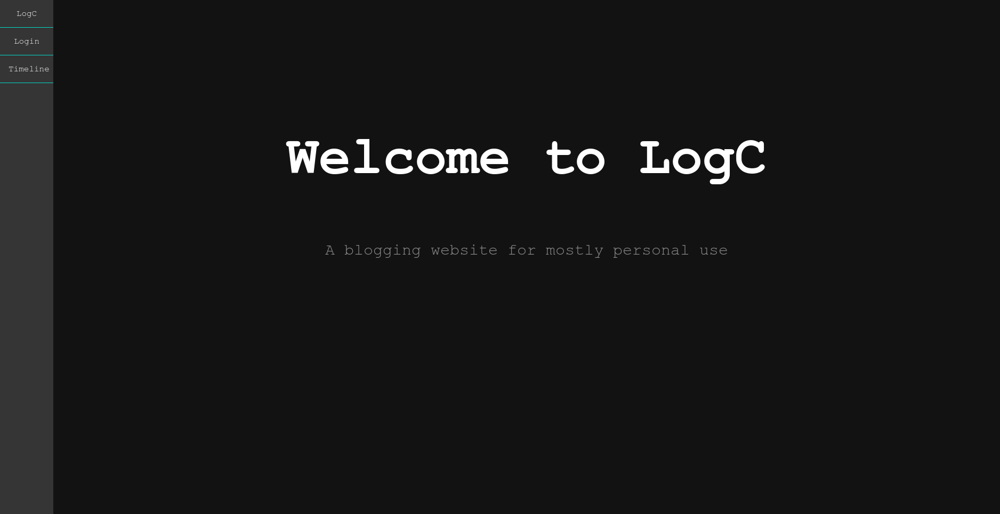
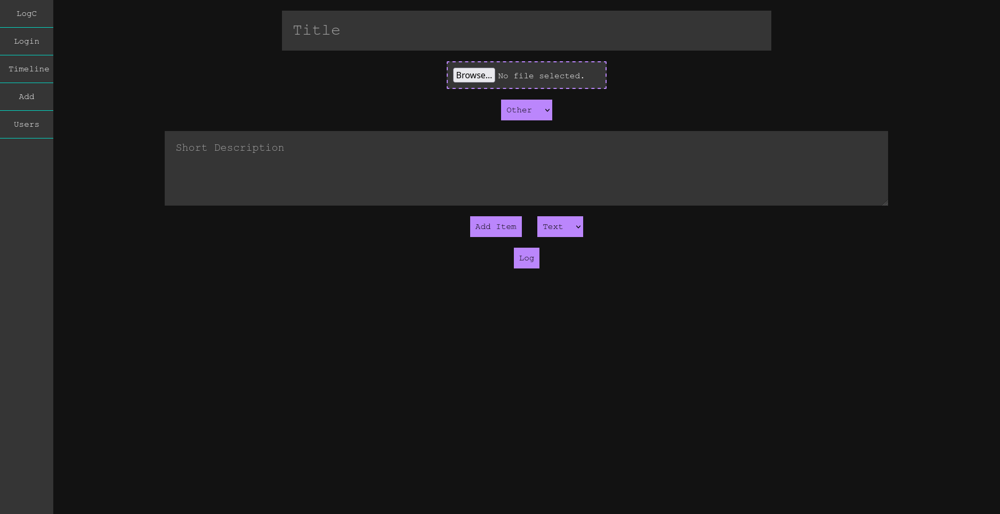
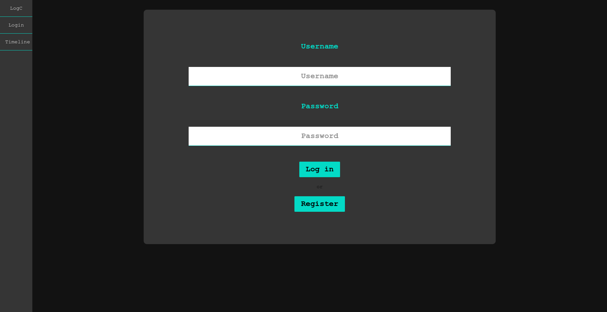
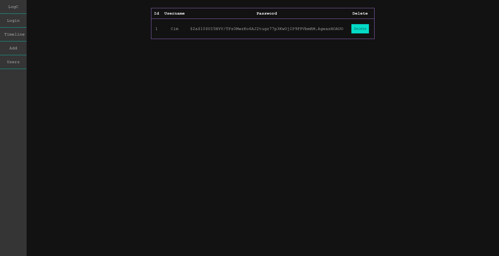
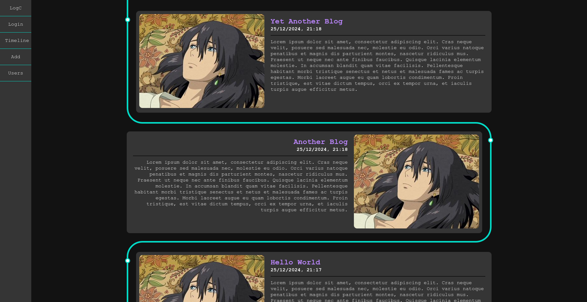
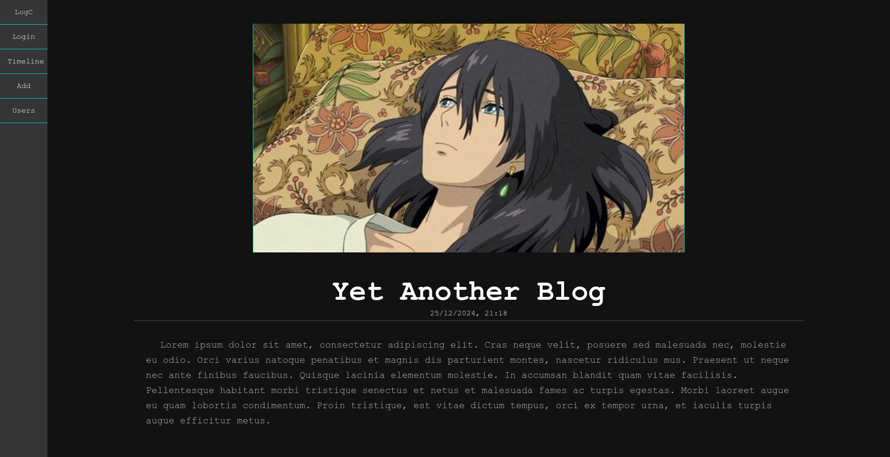
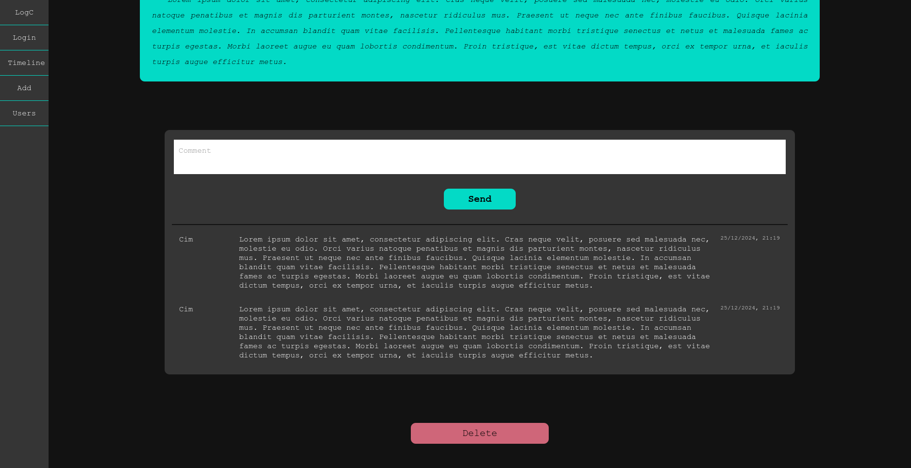

# LogC

LogC is a simple blogging website built with go using fiber and sqlite as database. It's a project I thought would be cool to have if I could afford to host a website to share what I'm up to sometimes

## Features

- Simple yet elegant design
- Secure user registration
- Simple comment system
- Easy to use blogging form
- Compact set of blogging tools
- Separation between back and front for simpler design

## Running

Firstly, download the entire project, then run using the following scripts:

### Windows

```
./run.bat
```

### Linux

```
./run.sh
```

Lastly go on localhost on port 8090

[Web](http://localhost:8090/)

## Design Overview

### Index


### Add


### Login


### User Management


### Timeline


### View Main


### Comments



## P.S.
The template picture used is that of Howl from the Studio Ghibli movie "Howl's Moving Castle"